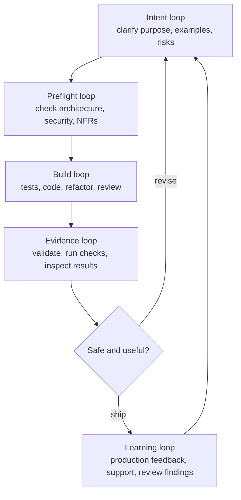
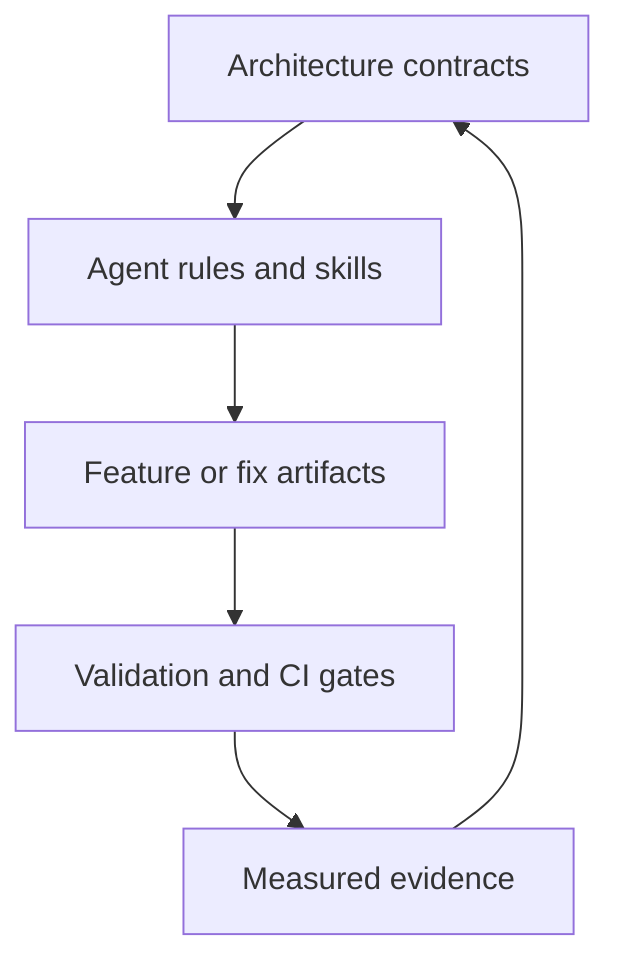
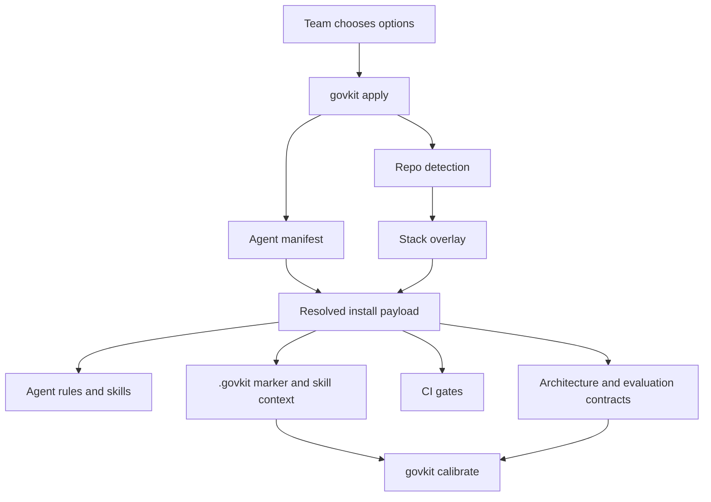

# GovKit Introductory Tutorial

This document synthesizes the govkit repository into an introductory tutorial.
The reference material near the end serves as an appendix and source map for
later video, PDF, or slide-deck production.

## What GovKit Is

GovKit is a guardrail toolkit for teams using AI coding agents. It puts the
team's architecture rules, quality standards, acceptance criteria, review
expectations, and release checks into the repository, where both the agent and
CI can read them.

It is for keeping AI-assisted changes under team control. The agent can still
generate code, plans, tests, and refactors, but it is expected to work from
explicit project contracts rather than guess from its training data. Developers
get clearer paths, QA gets inspectable acceptance and evidence, architects get
enforceable boundaries, and leaders get less risk that speed is replacing
engineering discipline.

It works by installing repo-local contracts, agent instructions, workflow
skills, feature templates, schemas, approval policies, and CI gates. In short:
GovKit does not govern people; it gives people a way to govern the delivery
conditions around AI-assisted software changes.

## Brownfield and Greenfield Workflows

GovKit can be used in greenfield and brownfield repositories. The delivery
loops are the same, but the adoption problem is different. Brownfield starts by
discovering the rails that already exist, then making them explicit. Greenfield
starts by declaring the intended rails before the codebase has much gravity.

### Brownfield Workflow

Brownfield use is first-class because most teams have more existing systems
than they know how to manage. The first job is not to impose GovKit defaults; it
is to discover and record how the system already works, then tighten the rails
gradually.

1. Inspect the existing repo before writing delivery guardrails into it.

   ```bash
   govkit apply --detect --agent codex --target .
   ```

   `--detect` previews GovKit's repo inference without writing files. Use it to
   decide the right target, project type, and stack before installing repo-held
   rules.

2. Apply GovKit to one repo or subdirectory, not necessarily the whole estate.
   In a monorepo, use one `govkit apply` per app or service directory. Start at
   Level 3 when you want to make existing rules visible first; start at Level 4
   when the team is ready to route new work through `features/<name>/` and the
   feature-package delivery loop.

3. Calibrate to reality. Review stack, architecture boundaries, API or query
   conventions, testing policy, CI gates, agent guidance, and skill context
   against the code that already exists.

   ```bash
   govkit calibrate --target .
   ```

   Calibration records the team's reality or intent. In brownfield, it corrects
   defaults against existing code.

4. Run `govkit doctor` to find mismatches between the installed rules and the
   actual repository. Resolve meaningful gaps; do not chase every theoretical
   cleanup before trying the workflow.

   ```bash
   govkit doctor --target .
   ```

   `doctor` is the fit check. It tells you where the installed rules do not
   line up with the repository shape, rules, stack, or configured extensions.

5. Choose a small, representative first change. If it restores
   already-established behavior, use the fix lane with `govkit-fix-record` and
   `govkit fix init <id>`. If it introduces new behavior, use the feature lane
   with `govkit init <feature>`.

6. Slice the work into a ready-to-deploy increment. Use
   `govkit-incremental-planning` to make that explicit: the first slice should
   be small enough to validate and ship on its own, while still improving the
   system. In brownfield systems, this often means finding an increment that
   exercises the workflow without forcing a large architecture cleanup.

7. Run backend or UI preflight for the chosen slice. For claims about coupling,
   ownership, or hotspots, use `govkit-evidence-tools` inside preflight, ADR
   authoring, planning, or review so the decision rests on evidence instead of
   guesswork.

8. If the slice exposes a real architecture decision or exception, draft the ADR
   with the relevant ADR skill and keep implementation waiting on human
   approval where the policy requires it.

9. Plan and implement one shippable increment. Use the backend or UI spec
   planning skill, the backend or UI implementation-plan skill, and the normal
   test-first build loop.

10. Validate the artifacts and evidence, then ship or revise.

    ```bash
    govkit validate --target .
    govkit doctor --target .
    govkit evidence --target .
    ```

11. Improve the rails over time. Brownfield success is not instant conformity;
    it is making implicit working agreements visible enough that the agent, the
    reviewers, and CI can use them reliably.

### Greenfield Workflow

The greenfield risk is that the agent invents the architecture while generating
the first useful code, and that first code quietly becomes the standard.

1. Choose the intended project shape: agent, maturity level, project type, CI
   platform, and stack.

   ```bash
   govkit apply --agent codex --level 4 --type api --ci github --stack python-fastapi --target .
   ```

   This example chooses the Codex agent, the L4 feature workflow, a backend API
   project, GitHub Actions, and the Python/FastAPI stack.

2. Calibrate the defaults into the team's intended architecture, test policy,
   CI posture, and agent guidance.

   ```bash
   govkit calibrate --target .
   ```

3. Create the first feature package.

   ```bash
   govkit init customer-search --target .
   ```

4. Work with the agent to clarify intent and choose the first ready-to-deploy
   increment. Use `govkit-incremental-planning` as the default slicing
   discipline: it helps identify the smallest independently demonstrable change
   that can be built, reviewed, validated, and shipped without waiting for the
   whole feature to be complete.

5. Run preflight before implementation. For backend/API/CLI/data work, use
   `govkit-architecture-preflight`. For UI work, use
   `govkit-ui-architecture-preflight`. For claims about boundaries, coupling,
   duplication, or hotspots, use the subordinate `govkit-evidence-tools` skill
   to bring in deterministic evidence from tools such as `terrier` or
   `scenter`.

6. If preflight identifies a new architectural decision, exception, or boundary
   change, use `govkit-adr-author` or `govkit-ui-adr-author` to draft a
   proposed ADR. Humans still approve the decision; the skill drafts the record.

7. Plan the slice. For backend/API/CLI/data work, use `govkit-spec-planning`.
   For UI work, use `govkit-ui-spec-planning`. These skills connect
   acceptance criteria, NFRs, preflight findings, and evaluation expectations.

8. Add specialist L5 skills only when the feature needs them:
   `govkit-genai-preflight` for LLM architecture decisions,
   `govkit-eval-suite-planning` for model evaluation, and
   `govkit-multi-agent-design` for governed agent topology.

9. Ask for an implementation plan. For backend/API/CLI/data work, use
   `govkit-implementation-plan`. For UI work, use
   `govkit-ui-implementation-plan`.

10. Build the slice in the normal code loop: failing test, implementation,
    refactor, local checks, human review. The agent can write much of the first
    pass, but the team reviews meaning, code, tests, and tradeoffs.

11. Validate and inspect evidence.

    ```bash
    govkit validate --target .
    govkit doctor --target .
    govkit evidence --target .
    ```

12. Ship the increment if it is safe and useful. After shipping, feed learning
    back into contracts, tests, examples, ADRs, thresholds, templates, or the
    next slice. The `govkit-papercuts` skill is subordinate throughout the
    workflow: it records small tool or process frictions when they force a
    retry or workaround.

| Question | Brownfield | Greenfield |
| --- | --- | --- |
| What are we protecting against? | Defaults conflicting with real code and team habits. | Agent-invented architecture becoming the foundation. |
| First human job | Discover and calibrate existing shape and standards. | Decide intended shape and standards. |
| First agent job | Help inventory, compare, and adapt the delivery system. | Scaffold and follow the intended delivery system. |
| Main command emphasis | `apply --detect`, `calibrate`, `doctor`. | `apply`, `calibrate`, `init`. |
| Best first increment | A small representative feature or fix that exercises the workflow. | A thin product slice that establishes the pattern. |
| Success signal | The rails describe reality closely enough to be trusted. | The first code lands inside clear rails. |

## What Different People Get From It

GovKit is useful because it turns vague trust in AI output into visible work
that different roles can inspect and influence.

| Role | What GovKit helps them do |
| --- | --- |
| Developer | Keep agent-written code tied to the repo's architecture, tests, and release checks instead of accepting a plausible patch on faith. |
| QA | See acceptance criteria, NFRs, evidence expectations, and reproduction tests early enough to shape the work before it ships. |
| Team lead | Break work into ready-to-deploy increments, keep review focused, and make delivery discipline repeatable across people and agents. |
| Executive | Get faster delivery without replacing engineering judgment with unreviewed agent output or invisible risk. |

## What It Is Like To Use

GovKit is used as an incremental delivery workflow for small, shippable slices
of change.

A feature starts as a shared direction of travel: intent, examples, risks,
acceptance criteria, NFRs, and guardrails. You and the agent refine just enough
of that map to choose the next coherent slice. That slice might be an empty
state, a read-only path, one input shape, one permission rule, one integration
case, or one operational signal. The feature package gives context; the
increment is what you actually build, review, validate, and possibly ship.

Each increment runs through nested loops. You clarify intent with the agent,
preflight the slice against architecture and safety rules, have the agent write
or update tests and code, review the result, run local and CI checks, inspect
the evidence, and either ship, revise, or stop. If the slice is safe and useful,
you can ship it immediately, even if the larger feature is not finished.

After shipping, the loop continues. Production learning, review findings, failed
gates, awkward tests, support feedback, or newly discovered risks feed back into
the feature artifacts, contracts, tests, and future slices. The result is
human-led, agent-assisted continuous delivery, where repo-held guardrails make
small releases safer and easier to repeat.

The core disciplines are defaults, not rescues. Collaboration, slicing,
test-first development, review, and evidence gathering are how the work moves
every day. GovKit should not present those practices as special measures for
unusually difficult work; it makes them easier to apply consistently.

## Command And Skill Vocabulary

You do not need to memorize the full command catalog to use GovKit. In an
LLM-enabled coding environment, you should be able to work in plain language
once the skills are installed: "continue the GovKit workflow for this feature",
"run preflight for the next increment", or "help me slice this into a
ready-to-deploy change." The short command vocabulary is still useful because
it lets you understand and approve what the agent is doing.

Most daily work uses three command surfaces:

| Surface | Examples | What it is for |
| --- | --- | --- |
| GovKit CLI | `govkit apply`, `govkit calibrate`, `govkit init`, `govkit validate`, `govkit doctor`, `govkit evidence` | Install, tune, check, and report the repo-held delivery guardrails. |
| Agent skills | `/govkit-architecture-preflight`, `/govkit-spec-planning`, `/govkit-implementation-plan` | Ask the coding agent to use GovKit's workflow while planning and building. |
| Project commands | `pytest`, `npm test`, `dotnet test`, CI jobs | Run the repository's normal tests, builds, linters, and checks. |

The most common terms are:

| Term | Meaning |
| --- | --- |
| `--agent` | Which coding agent receives the installed rules and skills: `codex`, `claude-code`, or `copilot`. |
| `--target` | The repo or subdirectory GovKit should install into. In monorepos, this is usually one app or service directory. |
| `--type` | The project shape: `api`, `cli`, `ui-react`, `ui-angular`, `ui-nextjs`, or `data`. |
| `--stack` | The backend or data runtime/framework overlay, such as `python-fastapi`, `dotnet-aspnet`, or `python-dbt`. UI project types do not use stack overlays. |
| `--ci` | The CI template family: `github` or `azure`. |
| `--level 3` | Foundation: architecture contracts, agent guidance, ADR support, and lean gates. No feature package workflow. |
| `--level 4` | Feature workflow: Level 3 plus `features/<name>/` packages, preflight, spec planning, implementation planning, validation, and richer gates. |
| `--level 5` | GenAI operations: Level 4 plus LLM, evaluation, safety, and multi-agent operating concerns. |

Daily cheat sheet:

```text
Adopt GovKit in an existing repo:
  govkit apply --detect --agent <agent> --target .
  govkit apply --agent <agent> --level 3 --type <type> --ci <ci> --stack <stack> --target .
  govkit calibrate --target .
  govkit doctor --target .

Start a new feature package:
  govkit init <feature> --target .
  ask the agent to run incremental planning, preflight, spec planning, and implementation planning

Before a PR or release:
  govkit validate --target .
  govkit doctor --target .
  govkit evidence --target .

Handle a true defect:
  govkit fix init <id> --target .
  ask the agent to use the GovKit fix-record lane
```

## Who Does What

GovKit works when responsibility stays clear. It is not a replacement for
human judgment, and it is not an invitation to trust the agent more blindly.
Pairing, ensemble work, QA collaboration, architecture review, and product
judgment are normal operating modes, not interventions saved for trouble.

| Participant | Primary responsibility |
| --- | --- |
| Humans | Decide intent, examples, tradeoffs, risk tolerance, architecture exceptions, and whether the increment should ship. |
| Agent | Draft feature-package files, inspect contracts, run preflight, propose slices, write or update tests, implement code, and summarize evidence. |
| Repository and CI | Validate feature and fix packages, run checks, enforce mechanical boundaries, report evidence, and reject work that violates configured gates. |

## Delivery Loops

GovKit's workflow is a set of nested loops:



Each loop can send the work back to an earlier loop. A failed gate might mean
the code is wrong, but it might also mean the test is weak, the chosen slice is
not independently deployable, an NFR is unclear, or the architecture contract
needs an ADR.

## One Increment Walkthrough

Suppose the team wants to add customer search.

1. The human describes the goal, examples, constraints, and known risks.
2. The agent drafts or updates `features/customer-search/acceptance.feature`,
   `nfrs.md`, and `eval_criteria.yaml`.
3. The team corrects meaning: what counts as matching, what is out of scope,
   what performance or privacy expectations apply, and what should be tested.
4. The agent runs architecture preflight against the repo's contracts and flags
   boundary, security, data, UI, or ADR concerns.
5. The team chooses a small first slice, such as a read-only search endpoint for
   one indexed field or a UI empty state wired to a stubbed API response.
6. The agent writes or updates a failing test for that slice, then writes code.
7. The human reviews the behavior, code, tests, and tradeoffs.
8. The repo runs `govkit validate`, `govkit doctor`, evidence reporting, CI
   gates, and the normal project test suite.
9. If the increment is safe and useful, the team can ship it before the full
   customer-search feature is complete.

The feature package gives direction and safety constraints. The increment is
the unit of build, review, validation, and release.

## Skill Families

The individual skills vary by agent and project type, but they fall into a few
teaching categories:

| Family | What it helps with |
| --- | --- |
| Preflight | Check a proposed slice against architecture, security, NFRs, repository scope, extension contracts, and ADR triggers before implementation. |
| Planning | Turn acceptance criteria, NFRs, and preflight findings into an implementation plan and evaluation expectations. |
| Build support | Keep implementation test-first, incremental, and tied to the agreed artifacts. |
| Decisions and exceptions | Draft ADRs when a new pattern, boundary change, or exception needs explicit review. |
| Fix lane | Keep true defect fixes small by proving they restore already-established behavior and introduce no new behavior. |
| Evidence and learning | Gather deterministic evidence, report validation results, and record process friction for later improvement. |

Important interaction rules:

- Preflight reads the architecture contracts first, then applicable extension
  contracts. Conflicts require an explicit manifest relationship or an ADR.
- Spec planning depends on completed feature specs and preflight output.
- Implementation planning depends on validated plan and evaluation criteria.
- ADR authoring creates `Proposed` decisions only. Acceptance is proven through
  `governance/approval_policy.yaml` and the ADR approval gate.
- The fix-record skill is a separate lane. It only applies when the change
  restores already-established behavior, has a failing reproduction test,
  introduces no new intended behavior, and changes no architecture/security/data
  or public contract.
- Evidence tools are deterministic support for claims about coupling, hotspots,
  cycles, co-change, and duplication; they do not make the decision.
- Incremental planning is the default discipline for sequencing work into
  small, independently demonstrable, ready-to-deploy increments.

## Feature Package Workflow

At L4 and above, a feature is represented by working files under
`features/<feature>/`.

| Artifact | Purpose |
| --- | --- |
| `acceptance.feature` | Gherkin scenarios and NFR tags. |
| `nfrs.md` | Repository scope, out-of-scope boundaries, and quality attributes. |
| `eval_criteria.yaml` | Predicted and measured evaluation criteria, thresholds, tools, and policy. |
| `architecture_preflight.md` | Boundary analysis, applicable standards, extension review, ADR decision, test needs, and risks. |
| `plan.md` | Ordered feature plan tied back to acceptance, NFRs, and evaluation criteria. |
| `design.md` | UI-only design contract for screens, states, accessibility, visual language, and brand use. |
| `agent_topology.md` | L5 multi-agent feature topology when `multi_agent: true` is declared. |

These are not a separate documentation phase. They are working surfaces the
agent can draft and update while the team corrects meaning, scope, tests, and
tradeoffs. The feature folder states what should be true, the architecture
preflight checks whether the change fits the architecture, the plan explains
how to proceed, and validation checks whether the package is complete enough to
trust.

## Brownfield CLI Tutorial

Use this path when GovKit is being introduced into an existing codebase. The
goal is to make real working agreements visible, not to force a new repo to
look like a template.

### 1. Install GovKit

```bash
pip install govkit
```

Install GovKit once in the developer environment or build image. In brownfield,
the next step is discovery before writing delivery guardrails into the repo.

### 2. Preview Detection Before Writing Files

```bash
govkit apply --detect --agent codex --target .
```

`--detect` is read-only. It reports what GovKit infers about the repository's
language, framework, CI platform, and likely stack. Use this before deciding
which target to install into, especially in monorepos.

### 3. Apply To One Real Target

```bash
govkit apply --agent codex --level 3 --type api --ci github --stack python-fastapi --target .
```

Flag notes:

- `--agent codex` selects the AI coding agent that should receive the rules and
  skills. Other supported values are `claude-code` and `copilot`.
- `--level 3` is often a good brownfield starting point because it helps the
  team make existing rules visible first.
- Use `--level 4` when the team is ready to start new work through
  `features/<name>/` packages and the feature-package delivery loop.
- Set `--type` and `--stack` to match what the repo already is, not what the
  team wishes it were.
- `--ci github` chooses the CI template family. Azure DevOps is also supported.
- `--target .` installs into the current directory. In a monorepo, point this at
  the app or service subdirectory instead.
- In a monorepo, apply GovKit separately to each app or service directory that
  should have its own rules, contracts, and CI gates.

### 4. Calibrate To Reality

```bash
govkit calibrate --target .
```

In brownfield, calibration is the core adoption step. Review the installed
contracts against the actual codebase and team habits. If the project uses clean
architecture, layered architecture, vertical slices, a custom test strategy, or
different CI expectations, record that reality before asking the agent to rely
on the contracts.

Use checklist mode when the team wants to review asynchronously:

```bash
govkit calibrate --non-interactive --target .
```

### 5. Run Doctor And Resolve Meaningful Mismatches

```bash
govkit doctor --target .
```

`doctor` checks workflow fit: rule globs, CI/stack/language match, stale
baselines, extension manifests, and project-shape-specific checks. In
brownfield adoption, treat findings as triage input. Fix the mismatches that
would make the agent or CI misleading; defer large cleanups that are not needed
for the first increment.

### 6. Choose A Low-Risk First Change

For true defects that restore already-established behavior:

```bash
govkit fix init missing-expiry-validation --target .
```

Use the `govkit-fix-record` skill to keep that lane narrow: the change needs an
established expectation, a failing reproduction test, no new intended behavior,
and no architecture/security/data/public-contract change.

For new behavior at L4 or L5:

```bash
govkit init customer-search --target .
```

Use the feature lane when the change adds behavior, changes expectations, or
needs explicit acceptance criteria and NFRs.

### 7. Drive The First Brownfield Increment

Use `govkit-incremental-planning` to choose the next ready-to-deploy increment.
In existing systems, the same default discipline is especially useful because
design pressure can make the slice hard to see. Then run the relevant preflight
and planning skills:

```text
/govkit-architecture-preflight customer-search
/govkit-spec-planning customer-search
/govkit-implementation-plan customer-search
```

For UI work, use the `govkit-ui-*` equivalents. Use `govkit-evidence-tools`
inside the work for structural claims. Use ADR skills when the slice exposes a
real decision or exception.

### 8. Validate, Inspect Evidence, And Tighten Gradually

```bash
govkit validate --target .
govkit doctor --target .
govkit evidence --target .
```

The first brownfield success is not perfect conformity. It is one safe,
understood increment plus better repo-held agreements than the team had before.

## Greenfield CLI Tutorial

Use this path when the repository is new or when a subdirectory is being set up
as a new service, UI, CLI, or data project.

### 1. Install GovKit

```bash
pip install govkit
```

GovKit is installed on the developer machine or build image. It is used to copy
delivery guardrails into the target project; it is not added as an application
runtime dependency.

### 2. Apply The Intended Shape

```bash
govkit apply --agent codex --level 4 --type api --ci github --stack python-fastapi --target .
```

Flag notes:

- `--agent codex` selects the AI coding agent that should receive the rules and
  skills. Other supported values are `claude-code` and `copilot`.
- `--level 4` selects the feature workflow. Level 3 installs foundation
  contracts without feature packages; Level 5 adds GenAI operations.
- `--type api` says this target is a backend API. Other project types include
  `cli`, `ui-react`, `ui-angular`, `ui-nextjs`, and `data`.
- `--ci github` chooses the CI template family. Azure DevOps is also supported.
- `--stack python-fastapi` chooses the backend stack overlay. UI project types
  do not use stack overlays because the UI framework is selected by `--type`.
- `--target .` installs into the current directory. In a monorepo, point this at
  the app or service subdirectory instead.

### 3. Calibrate The Starting Rails

```bash
govkit calibrate --target .
```

Calibration is where the team turns generic defaults into project decisions. In
greenfield work, those decisions describe the intended architecture, stack,
testing approach, CI posture, and agent guidance before the first patterns
become accidental precedent.

### 4. Create The First Feature Package

```bash
govkit init customer-search --target .
```

`govkit init` creates the feature artifact folder at L4 and L5. Use the agent to
draft and refine the artifacts; the team owns the meaning.

### 5. Drive The First Increment With Skills

For a backend/API feature:

```text
/govkit-architecture-preflight customer-search
/govkit-spec-planning customer-search
/govkit-implementation-plan customer-search
```

For a UI feature:

```text
/govkit-ui-architecture-preflight customer-search
/govkit-ui-spec-planning customer-search
/govkit-ui-implementation-plan customer-search
```

Use `govkit-incremental-planning` before spec planning to choose the next
ready-to-deploy increment. The skill is the normal discipline of keeping each
slice independently demonstrable, reviewable, and shippable. Use
`govkit-adr-author` or `govkit-ui-adr-author` when preflight exposes a new
decision, exception, or boundary change. Use `govkit-evidence-tools` inside
preflight, planning, ADRs, or review for deterministic evidence about coupling,
hotspots, or duplication.

### 6. Validate, Inspect Evidence, And Ship The Slice

```bash
govkit validate --target .
govkit doctor --target .
govkit evidence --target .
```

`validate` checks feature and fix packages. `doctor` checks whether the
installed rules still fit the repository. `evidence` reports measured
quality evidence and leaves missing measurements inconclusive rather than
pretending they passed.

Ship the increment when it is safe and useful. Then feed what you learned back
into the next slice, the tests, or the contracts.

## Shared CLI Reference

### Extensions

List extension packs:

```bash
govkit extension list
```

Add one:

```bash
govkit extension add llm-application --target .
```

Extensions add contract packs for specialized domains. The bundled packs cover
provider-neutral LLM applications, vision inference, and skill-oriented agent
architecture. Install them when the project needs those constraints; do not add
them just to make a first adoption look complete.

### Upgrades And Stack Changes

Refresh files GovKit owns while preserving project-owned edits:

```bash
govkit upgrade --target .
```

List and change stack overlays:

```bash
govkit stack list
govkit stack apply java-spring-boot --target .
```

Stack changes rewrite stack-specific contract defaults. Recalibrate after
changing stacks so the marker and skill context reflect the team's decision.

## Presentation-Friendly Narrative

GovKit can be explained as five cooperating control loops:



1. Architecture contracts define the team standard.
2. Agent rules and skills translate that standard into coding-agent behavior.
3. Feature and fix packages make intent, scope, risks, and evaluation policy
   inspectable while the work is still small enough to steer.
4. Validation and CI gates keep the files and implementation honest.
5. Evidence closes the loop by reporting observed quality instead of relying on
   prediction or agent confidence.

## Suggested Next Documentation Steps

- Add a short command transcript for `apply -> calibrate -> init -> validate`.
- Add one backend and one UI walkthrough using the existing starter feature
  directories.
- Use `GOVKIT_POSITIONING_CHECKS.md` when turning this into marketing or
  presentation material.
- Add a diagram per maturity level showing the exact installed file surface.
- Turn this document into a slide outline with sections for "why", "contents",
  "workflow", "controls", and "operating model".
- Record short videos around the CLI lifecycle and around a single governed
  feature package.

## Appendix: Reference Map

The sections above are the teaching path. Use this appendix once the reader
needs to find the underlying files.

| Area | Key paths | Purpose |
| --- | --- | --- |
| CLI | `cli/` | Command implementation for applying, calibrating, validating, upgrading, evidence reporting, stack management, extension management, and autonomous-run verdicts. |
| Agent payloads | `agents/claude-code/`, `agents/copilot/`, `agents/codex/` | Agent-specific manifests, rule files, instruction files, and skills. |
| Core contracts | `docs/backend/architecture/`, `docs/ui/architecture/`, `docs/data/architecture/` | Architecture, testing, boundaries, NFR conventions, API/UI/data standards, and ADR templates. |
| Evaluation docs | `docs/backend/evaluation/`, `docs/ui/evaluation/` | Eval criteria guidance, evidence contracts, FIRST rubric, and seven code-virtues rubric. |
| Governance schemas | `governance/schemas/`, `governance/backend/schemas/`, `governance/ui/schemas/`, `governance/data/schemas/` | JSON Schemas for marker files, approval policy, extension manifests, stack overlays, fix records, agent manifests, and eval criteria. |
| Shared governance | `governance/approval_policy.yaml`, `governance/backend/templates/`, `governance/ui/templates/` | Approval policy and generated artifact templates. |
| Feature starters | `features/starter_*` | L4/L5 feature artifact templates for backend, CLI, UI, Next.js UI, data, and L5 backend work. |
| Worked examples | `features/schema_contract_example/`, `features/ui_task_dashboard/`, `features/example-jwt-unification/` | Example governed feature material. |
| Stack overlays | `cli/stacks/` | Runtime/framework-specific contract overlays for backend and data project types. |
| CI gates | `ci/github/`, `ci/azure/` | Type-, level-, stack-, and extension-aware workflow templates. |
| Extensions | `extensions/` | Optional contract packs for LLM applications, vision inference, and skill-oriented agent architecture. |
| Tests | `tests/` | Regression coverage for CLI behavior, schema contracts, manifests, templates, stack selection, validation, and CI composition. |
| Research/planning | `plans/`, `plans/research/` | Design plans, product positioning, page prototypes, and roadmap material. |

## Appendix: Installation Reference

When GovKit is applied, it installs one configured project shape at a time. The
selected agent, project type, maturity level, CI platform, and stack determine
which payloads are copied.



The three production agent payloads are parallel but not identical:

| Agent | Installed governance style |
| --- | --- |
| Claude Code | Rules under `.claude/rules/govkit/` and skills under `.claude/skills/govkit-*`. |
| GitHub Copilot | Instructions under `.github/instructions/govkit/` and skills under `.github/skills/govkit-*`. |
| OpenAI Codex | Managed blocks in `AGENTS.md` and nested path-scoped `AGENTS.md` files, plus skills under `.agents/skills/govkit-*`. |

Codex differs because it has no separate rules directory in this kit. Its
manifest writes managed governance blocks into `AGENTS.md` while preserving
user-authored material around the fenced govkit block.

## Appendix: Maturity Reference

| Level | Name | What changes |
| --- | --- | --- |
| L3 | Governed AI Delivery, Foundations | Installs agent rules, architecture contracts, ADR authoring, and lean quality gates. No per-feature `features/` workflow. |
| L4 | Spec-Driven Add-On | Adds feature packages, preflight/spec/implementation skills, test-first and spec-compliance rules, feature validation, and richer governance gates. |
| L5 | GenAI Operations | Adds LLM and multi-agent operating constraints, L5 feature starters, GenAI preflight, eval-suite planning, and extension-aware guidance. |

The levels are additive: L4 includes L3 practices, and L5 includes L4
practices. The governance instruction file is re-issued per level so the agent
sees the current operating mode.

## Appendix: Project Shape and Stack Reference

GovKit supports these project types:

- `api`
- `cli`
- `ui-react`
- `ui-angular`
- `ui-nextjs`
- `data`

Backend and data shapes can use stack overlays from `cli/stacks/`:

| Stack id | Summary |
| --- | --- |
| `python-fastapi` | Python 3.11+, FastAPI, pydantic, SQLAlchemy, pytest, pytest-bdd. |
| `dotnet-aspnet` | C# 12, .NET 8, ASP.NET Core Minimal APIs, xUnit, Moq, optional Reqnroll. |
| `java-spring-boot` | Java 21, Spring Boot 3, Spring Web MVC, JUnit 5, Mockito, optional Cucumber. |
| `nodejs-fastify` | Node.js 20 LTS, TypeScript 5, Fastify 4, Vitest, optional Cucumber-JS. |
| `go-gin` | Go 1.22+, Gin, standard library testing, testify, optional godog. |
| `python-dbt` | Python 3.11+, dbt-core, warehouse adapter, SQLfluff, dbt tests. |
| `databricks-lakehouse` | Databricks Lakehouse, Unity Catalog, Delta, Asset Bundles, Jobs, Lakeflow Pipelines, PySpark, SQL, notebooks. |

UI framework selections are standalone project types, not overlays. This avoids
mixing UI framework governance with backend/data stack governance.

## Appendix: Full Skills Inventory

The Codex skill set is the clearest compact inventory because it mirrors the
same governed workflow across the agent payloads.

| Skill | Location | Use |
| --- | --- | --- |
| `govkit-architecture-preflight` | `agents/codex/skills/backend/architecture-preflight/SKILL.md` | Validate architecture boundaries, standards alignment, extension applicability, repository scope, ADR need, and required tests before planning. |
| `govkit-spec-planning` | `agents/codex/skills/backend/spec-planning/SKILL.md` | Generate or update `plan.md` and `eval_criteria.yaml` from NFRs, Gherkin, and preflight findings. |
| `govkit-implementation-plan` | `agents/codex/skills/backend/implementation-plan/SKILL.md` | Produce an ordered implementation checklist and evaluation compliance summary from validated planning inputs. |
| `govkit-adr-author` | `agents/codex/skills/backend/adr-author/SKILL.md` | Author a proposed ADR for a new pattern, exception, or boundary change. |
| `govkit-fix-record` | `agents/codex/skills/backend/fix-record/SKILL.md` | Route qualifying defects through the narrow fix lane using `fixes/<id>/fix.yaml`. |
| `govkit-genai-preflight` | `agents/codex/skills/backend/genai-preflight/SKILL.md` | Validate L5 provider-neutral LLM decisions after architecture preflight. |
| `govkit-eval-suite-planning` | `agents/codex/skills/backend/eval-suite-planning/SKILL.md` | Plan provider-neutral model evaluation suites for LLM features. |
| `govkit-multi-agent-design` | `agents/codex/skills/backend/multi-agent-design/SKILL.md` | Design governed multi-agent topology and produce `agent_topology.md`. |
| `govkit-ui-architecture-preflight` | `agents/codex/skills/ui/architecture-preflight/SKILL.md` | Validate UI architecture, backend contracts, accessibility, design readiness, and ADR need before UI planning. |
| `govkit-ui-spec-planning` | `agents/codex/skills/ui/spec-planning/SKILL.md` | Generate UI `plan.md` and `eval_criteria.yaml` from UI specs and preflight. |
| `govkit-ui-implementation-plan` | `agents/codex/skills/ui/implementation-plan/SKILL.md` | Produce an ordered UI implementation checklist. |
| `govkit-ui-adr-author` | `agents/codex/skills/ui/adr-author/SKILL.md` | Author UI ADRs. |
| `govkit-evidence-tools` | `agents/codex/skills/otter/evidence-tools/SKILL.md` | Bring deterministic tool evidence from `terrier` and `scenter` into structural claims about coupling, hotspots, cycles, co-change, or duplication. |
| `govkit-incremental-planning` | `agents/codex/skills/otter/incremental-planning/SKILL.md` | Split work into the smallest independently demonstrable increments before coding. |
| `govkit-papercuts` | `agents/codex/skills/otter/papercuts/SKILL.md` | Record small workflow/tooling frictions in `PAPERCUTS.json`. |
