# Agent Workflow Diagram

The loop every feature follows after `govkit apply`, regardless of which agent you chose.

```mermaid
flowchart TD
    Start([New feature request]) --> Spec

    Spec["<b>1. Spec</b><br/>Run <code>spec-planning</code> skill<br/>Produces: plan.md"]
    Spec --> SpecReview{Spec<br/>approved?}
    SpecReview -- No --> Spec
    SpecReview -- Yes --> Preflight

    Preflight["<b>2. Architecture Preflight</b> <i>(L4+)</i><br/>Run <code>architecture-preflight</code> skill<br/>Checks against docs/&lt;area&gt;/architecture/<br/>Produces: architecture_preflight.md"]
    Preflight --> PreflightReview{Boundaries<br/>respected?}
    PreflightReview -- No --> Spec
    PreflightReview -- Yes --> Plan

    Plan["<b>3. Plan</b><br/>Run <code>implementation-plan</code> skill<br/>Step-by-step plan grounded in rules + preflight"]
    Plan --> PlanReview{Plan<br/>approved?}
    PlanReview -- No --> Plan
    PlanReview -- Yes --> Implement

    Implement["<b>4. Implement</b><br/>Agent writes code<br/>Path-scoped rules auto-attach<br/>(api.md, services.md, ports.md, adapters.md...)"]
    Implement --> Evaluate

    Evaluate["<b>5. Evaluate</b> <i>(L4+)</i><br/>Score against eval_criteria.yaml<br/>FIRST + Virtues rubrics"]
    Evaluate --> EvalScore{Score<br/>passes?}
    EvalScore -- No --> Plan
    EvalScore -- Yes --> Validate

    Validate["<b>6. Validate</b><br/><code>govkit validate</code><br/>Confirms governance install is intact"]
    Validate --> Done([Feature ready to merge])

    classDef step fill:#1f3a5f,stroke:#4a90e2,color:#fff,stroke-width:2px
    classDef decision fill:#3d2f5f,stroke:#9b6bcc,color:#fff
    classDef terminal fill:#1f5f3a,stroke:#4ae290,color:#fff,stroke-width:2px

    class Spec,Preflight,Plan,Implement,Evaluate,Validate step
    class SpecReview,PreflightReview,PlanReview,EvalScore decision
    class Start,Done terminal
```

## How to read this

- **Blue boxes** are the six workflow steps.
- **Purple diamonds** are human review gates — *you* approve before the agent moves forward.
- **Green ovals** are the start and end of the loop.
- **Backward arrows** show where failed gates send you: a bad eval score returns to planning, not implementation.

## What stays constant across agents

The diagram is identical for Claude Code, Codex, and Copilot. Only the file the agent reads to find its rules differs:

| Agent | Top-level governance | Path-scoped rules |
|---|---|---|
| Claude Code | `CLAUDE.md` | `.claude/rules/*.md` |
| Codex | `AGENTS.md` | nested `AGENTS.md` per folder |
| Copilot | `.github/copilot-instructions.md` | `.github/instructions/*.instructions.md` |
